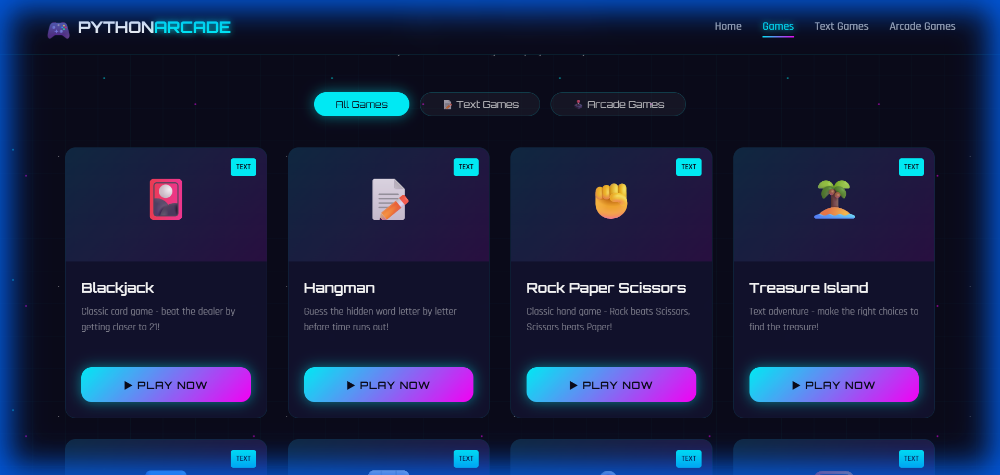
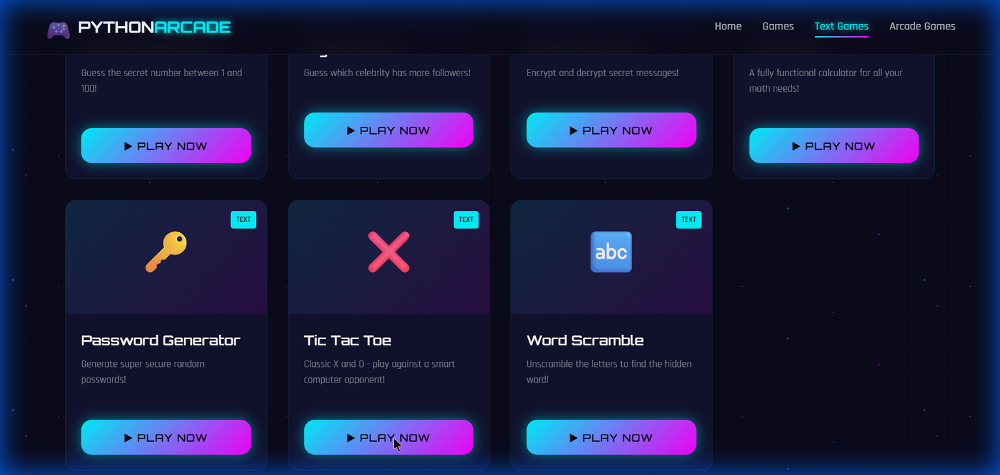
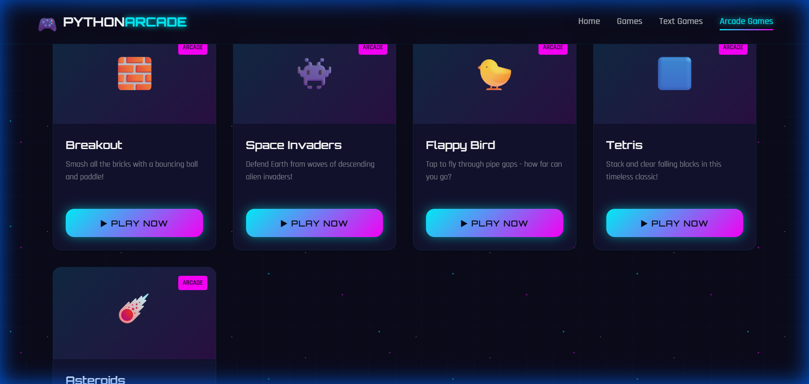
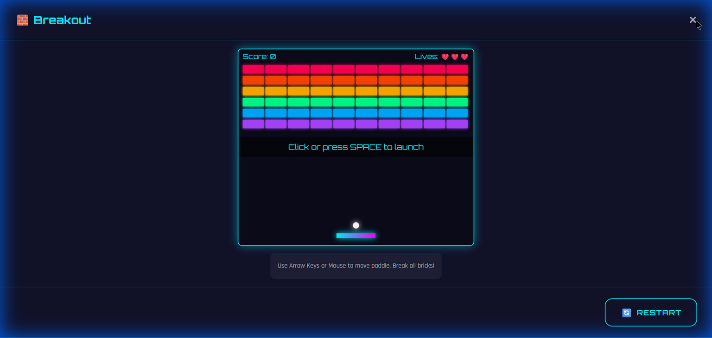

# 🎮 Python Arcade

A **fully browser-based arcade website** featuring 22 playable games — from text-based adventures to canvas-rendered arcade classics. Built entirely with **vanilla HTML, CSS, and JavaScript** — zero frameworks, zero dependencies.



---

## ✨ Features

- **22 Games** — 11 text-based + 11 arcade games, all playable in-browser
- **Neon Retro Theme** — Cyberpunk-inspired UI with glitch effects, gradient animations, and glow effects
- **Fullscreen Game Modals** — Games launch in responsive fullscreen overlays with proper aspect ratio scaling
- **Zero Dependencies** — Pure HTML5, CSS3, and vanilla JavaScript — no libraries, no build tools
- **Responsive Design** — Works on desktop and tablet screens
- **Instant Play** — No downloads, installations, or accounts needed

---

## 🕹️ Game Library

### 📝 Text Games

| # | Game | Icon | Description |
|---|------|------|-------------|
| 1 | **Blackjack** | 🎴 | Beat the dealer — get closest to 21 without busting |
| 2 | **Hangman** | 📝 | Guess the hidden word letter by letter |
| 3 | **Rock Paper Scissors** | ✊ | Classic hand game vs the computer |
| 4 | **Treasure Island** | 🏝️ | Choose-your-own-adventure text game |
| 5 | **Guess the Number** | 🔢 | Find the secret number between 1–100 |
| 6 | **Higher Lower** | 📊 | Which celebrity has more followers? |
| 7 | **Secret Encoder** | 🔐 | Caesar cipher — encrypt & decrypt messages |
| 8 | **Calculator** | 🧮 | Fully functional math calculator |
| 9 | **Password Generator** | 🔑 | Generate secure random passwords |
| 10 | **Tic Tac Toe** | ❌ | Play X and O against a smart AI |
| 11 | **Word Scramble** | 🔤 | Unscramble letters to find the hidden word |



### 🕹️ Arcade Games

| # | Game | Icon | Description |
|---|------|------|-------------|
| 1 | **Snake** | 🐍 | Eat food, grow longer, don't hit walls |
| 2 | **Pong** | 🏓 | Two-player paddle battle |
| 3 | **Road Crossing** | 🐢 | Help the turtle dodge traffic (4-way movement) |
| 4 | **Turtle Racing** | 🏁 | Bet on a turtle and watch them race |
| 5 | **Breakout** | 🧱 | Smash rainbow bricks with paddle and ball |
| 6 | **Space Invaders** | 👾 | Defend Earth from descending alien waves |
| 7 | **Flappy Bird** | 🐤 | Tap to fly through pipe gaps |
| 8 | **Tetris** | 🟦 | Stack and clear falling blocks |
| 9 | **Asteroids** | ☄️ | Pilot your ship, dodge and blast asteroids |
| 10 | **Minesweeper** | 💣 | Reveal cells, flag mines, don't explode |
| 11 | **Memory Match** | 🃏 | Flip cards and find matching emoji pairs |



---

## 🚀 Getting Started

### Play Locally

1. Clone the repository:
   ```bash
   git clone https://github.com/yourusername/python-arcade.git
   ```

2. Open the website:
   ```bash
   cd python-arcade/website
   ```

3. Open `index.html` in your browser — that's it! No server needed.

> 💡 You can also just double-click `index.html` to open it directly.

---

## 📁 Project Structure

```
Arcade/
├── website/
│   ├── index.html          # Main HTML page
│   ├── style.css           # All styles (neon theme, animations, responsive)
│   ├── script.js           # Game registry, modal system, UI logic
│   ├── games.js            # All 22 game implementations (~3000 lines)
│   └── games/              # Original Python game source files
│       ├── cli/            # Text game sources (Blackjack, Hangman, etc.)
│       └── gui/            # Arcade game sources (Snake, Pong, etc.)
├── screenshots/            # Screenshots for README
└── README.md
```

### Key Files

| File | Lines | Purpose |
|------|-------|---------|
| `games.js` | ~3000 | All 22 game implementations in JavaScript |
| `script.js` | ~470 | Game registry, modal system, terminal emulator, canvas scaling |
| `style.css` | ~900 | Full neon theme, animations, responsive layout |
| `index.html` | ~200 | Page structure, modals, navigation |

---

## 🛠️ Tech Stack

| Technology | Usage |
|------------|-------|
| **HTML5** | Page structure, semantic elements, Canvas API |
| **CSS3** | Custom properties, gradients, keyframe animations, glassmorphism |
| **JavaScript** | Game logic, DOM manipulation, Canvas 2D rendering, event handling |
| **Google Fonts** | Orbitron & Rajdhani for the retro-futuristic look |

---

## 🎨 Design Highlights

- **Glitch text effect** on the hero title
- **Animated star-field** background
- **Gradient neon buttons** with hover glow effects
- **Arcade machine** visual element on the landing page
- **Smooth modal transitions** for game launch
- **Responsive canvas scaling** — games maintain aspect ratio at any screen size



---

## 🎮 Game Controls

### Text Games
Type your input in the terminal and press **Enter** to play.

### Arcade Games

| Game | Controls |
|------|----------|
| Snake | Arrow keys |
| Pong | W/S (Player 1) • Arrow Up/Down (Player 2) |
| Road Crossing | Arrow keys (Up, Down, Left, Right) |
| Turtle Racing | Click to bet on a turtle |
| Breakout | Mouse/Arrow keys + Space to launch |
| Space Invaders | Arrow keys + Space to shoot |
| Flappy Bird | Space / Click to flap |
| Tetris | Arrow keys + Space for hard drop |
| Asteroids | Arrow keys + Space to shoot |
| Minesweeper | Left-click reveal, Right-click flag |
| Memory Match | Click to flip cards |

---

## 📄 License

This project is open source and available under the [MIT License](LICENSE).

---

## 🤝 Contributing

Contributions are welcome! Feel free to:
- Add new games
- Improve existing game mechanics
- Enhance the UI/UX
- Fix bugs

---

<p align="center">
  Made with ❤️ and JavaScript<br>
  <strong>No frameworks were harmed in the making of this project.</strong>
</p>
